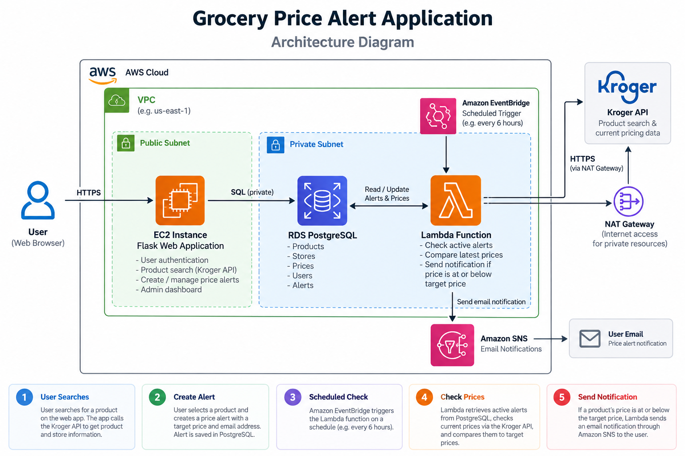
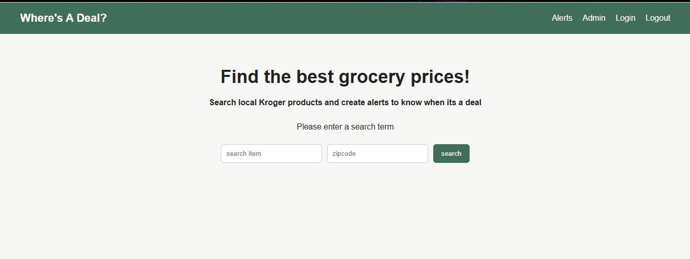
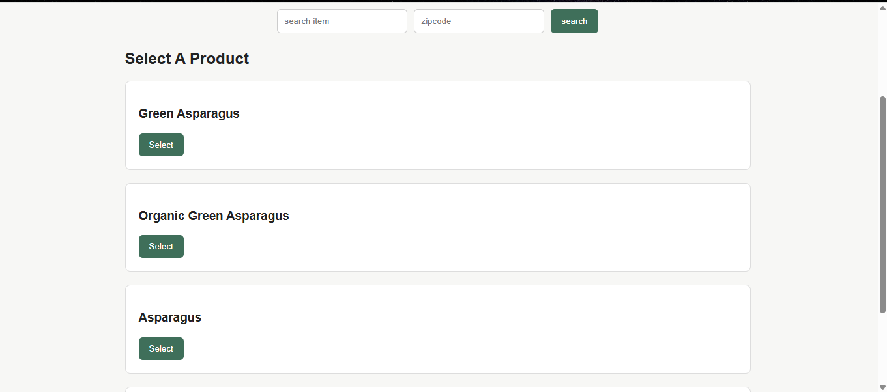
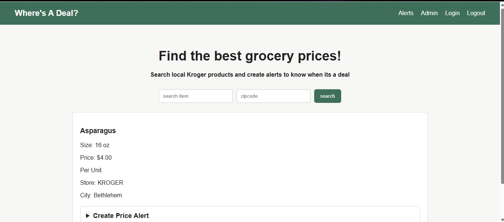
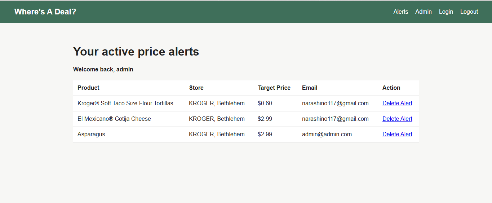
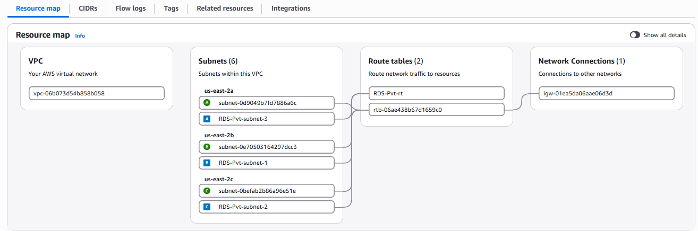

# Where's A Deal

Where's A Deal is a grocery price tracking and alert notification app built with Python, Flask, PostgreSQL, and AWS.

Users have the ability to search for products at their local Kroger-owned store, select which product to retrieve its price, and create an alert to notify them when it has reached their target price. The app stores the tracked products and alerts in PostgreSQL, while a scheduled AWS Lambda function routinely checks the Kroger API for updated prices and promos. When a specified product reaches its target price, an email will be sent using Amazon SNS.

I built this project to gain hands-on experience developing and deploying a full-stack Python application while connecting multiple AWS services in a real setting.

## Features

- Search for grocery products using a keyword and ZIP code using the Kroger API
- Select and track specific Kroger products
- Store products, stores, prices, users, and alerts in PostgreSQL
- Register users and log in using hashed passwords
- Create and delete price alerts
- Admin dashboard for managing application data
- Handle regular and promotional Kroger pricing
- Automatically check tracked prices with AWS Lambda
- Schedule routine price checks with Amazon EventBridge
- Send price alert emails through Amazon SNS
- Deploy a Flask application on Amazon EC2 using Gunicorn

## Architecture

The application combines a Flask web application with scheduled serverless processing.



## Application Flow

1. The user searches for a product and enters a ZIP code.
2. The Flask application requests matching products and nearby store information from the Kroger API.
3. The user selects a specific product and can create a target price alert.
4. Product, store, price, user, and alert information is stored in PostgreSQL on Amazon RDS.
5. Amazon EventBridge invokes the price-checking Lambda function on a schedule.
6. Lambda retrieves active alerts from RDS and checks the Kroger API for the latest product price.
7. The latest price is stored and compared with the user's target price.
8. If the target price is reached, Amazon SNS publishes an email notification.

## Tech Stack

### Application

- Python
- Flask
- SQLAlchemy
- Jinja2
- HTML
- SCSS / CSS
- Gunicorn

### Database

- PostgreSQL / Amazon RDS
- SQLite for local development

### AWS

- Amazon EC2
- Amazon RDS
- AWS Lambda
- Amazon EventBridge
- Amazon SNS
- Amazon VPC
- NAT Gateway

### APIs and Tools

- Kroger API
- Git
- GitHub

## Screenshots

### Product Search



### Product Results



### Price Alert



### Alert Dashboard



## AWS Infrastructure

The Flask application was deployed to an Amazon Linux EC2 instance and served using Gunicorn. Application data was stored on SQLite during local development and later moved to PostgreSQL hosted on Amazon RDS.

The scheduled price-checking process runs separately from the Flask web server. Amazon EventBridge invokes AWS Lambda, which connects to RDS to retrieve active alerts and then requests current pricing from the Kroger API.

Because Lambda was deployed in private VPC subnets, a NAT Gateway was configured to provide outbound internet access to the Kroger API while keeping the Lambda function private.

When an alert reaches its target price, Lambda publishes a notification through Amazon SNS.

### VPC Resource Map



## Database

SQLAlchemy is used as the ORM for both local SQLite development and the production PostgreSQL database.

The application contains models for:

- `Users` - user accounts and authentication
- `Product` - tracked Kroger products and their Kroger product IDs
- `Store` - Kroger store locations
- `Price` - product pricing and unit information
- `Alerts` - users' target price alerts

Kroger product IDs are used to uniquely identify products instead of relying on generic search terms. For example, multiple products returned from a search for `chicken` can be stored and tracked independently.

## Security

- User passwords are hashed rather than stored as plaintext
- Application credentials and API secrets are stored in environment variables
- Database credentials are not stored in the source code
- User alert deletion is restricted to the alert owner or an administrator
- Administrative functionality requires an authenticated administrator account

## Challenges Faced and What I Learned

One of the biggest challenges of this project was moving beyond a locally running Flask application and designing the infrastructure required to run different parts of the application in AWS.

Some of the major things I worked through included:

- Moving from SQLite to PostgreSQL on Amazon RDS
- Deploying Flask to Amazon Linux on EC2
- Running Flask behind Gunicorn
- Configuring security groups and VPC networking
- Giving a private Lambda function outbound API access through a NAT Gateway
- Packaging Python dependencies for Lambda
- Connecting Lambda to PostgreSQL
- Scheduling automated price checks with EventBridge
- Publishing notifications with SNS
- Handling Kroger promotional versus regular pricing
- Refactoring product tracking to use Kroger product IDs instead of search terms

## Current Limitations

Email alerts currently use an Amazon SNS topic with a confirmed email subscription. This demonstrates the complete automated notification pipeline, but notifications are not currently routed independently to each user's email address.

A future version could use Amazon SES to send notifications directly to the email associated with each alert.

## Future Improvements

- Use Amazon SES for per-user email notifications
- Recreate the AWS infrastructure using Terraform
- Containerize the application with Docker
- Add Nginx and HTTPS in front of Gunicorn
- Add automated testing
- Add CI/CD deployment
- Track historical prices and display price charts
- Support additional grocery retailers
- Add database migrations with Flask-Migrate/Alembic

## Running Locally

### 1. Clone the Repository

```bash
git clone https://github.com/WSmith1999/wheres-a-deal.git
cd wheres-a-deal
```

### 2. Create a Virtual Environment

```bash
python -m venv venv
```

Activate the virtual environment.

Windows:

```bash
venv\Scripts\activate
```

Linux/macOS:

```bash
source venv/bin/activate
```

### 3. Install Dependencies

```bash
pip install -r requirements.txt
```

### 4. Configure Environment Variables

Create a `.env` file in the project directory and add the required environment variables:

```text
CLIENT_ID=your_kroger_client_id
CLIENT_SECRET=your_kroger_client_secret
app_secret_key=your_flask_secret_key
DATABASE_URL=your_database_url
SNS_TOPIC_ARN=your_sns_topic_arn
```

The Kroger API credentials can be obtained by creating an application through the Kroger Developer Portal.

### 5. Create the Database

For local development, the application can be configured to use SQLite:

```python
app.config["SQLALCHEMY_DATABASE_URI"] = "sqlite:///test.db"
```

Create the database tables using the Flask shell:

```bash
flask shell
```

Then run:

```python
db.create_all()
exit()
```

### 6. Run the Application

```bash
flask run
```

The application will then be available on the local Flask development server.

## Project Status

Version 1.0 is complete. The AWS infrastructure used for the deployed version was removed after development and testing to avoid ongoing cloud costs.

The repository contains the Flask application, Lambda price-checking code, database models, architecture documentation, and screenshots from the deployed AWS environment.
