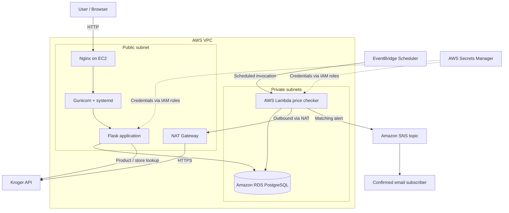
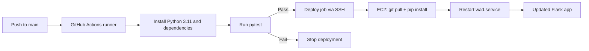
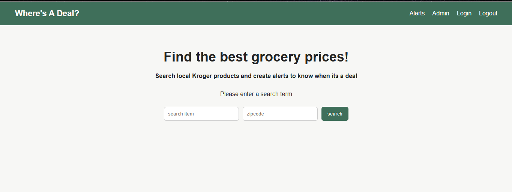
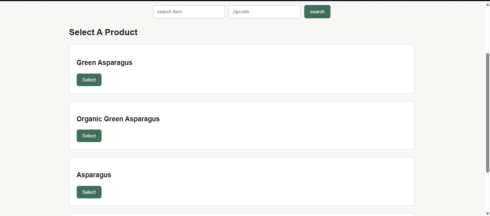
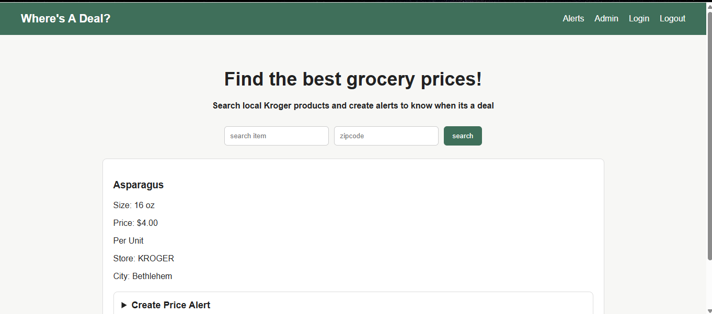
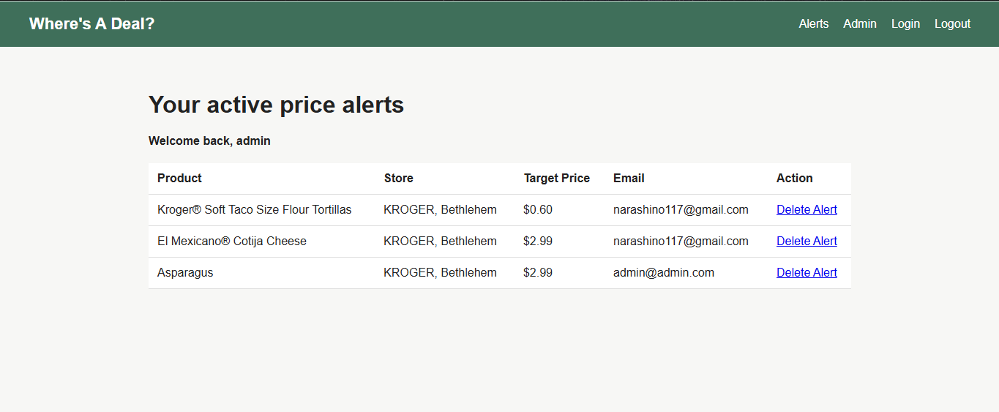
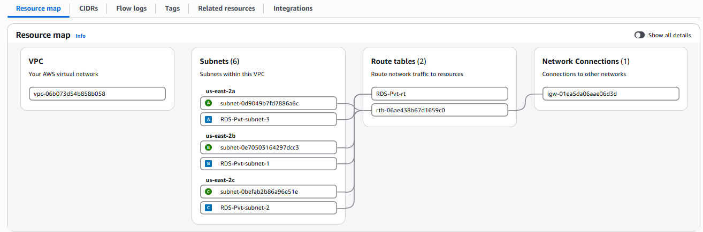
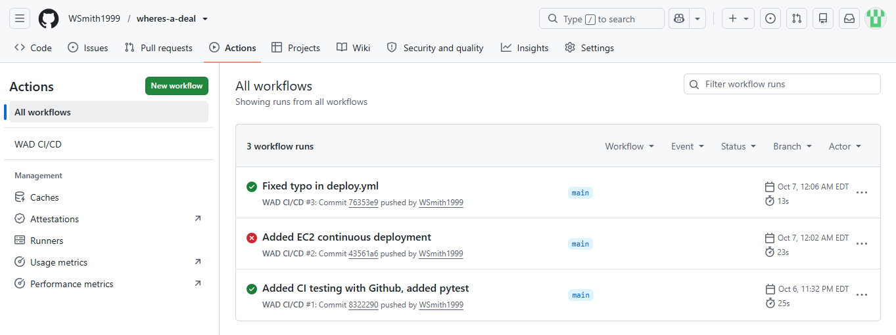

# Where's A Deal

**A Python/Flask grocery price tracker with AWS infrastructure, scheduled price alerts, and automated CI/CD deployment.**

Where's A Deal lets users search Kroger products by keyword and ZIP code, retrieve store-specific prices, and set target-price alerts. I built this project to gain hands-on experience developing and deploying a full-stack Python application while connecting multiple AWS services in a real setting.

**Project focus:** Python · Flask · PostgreSQL · AWS · Terraform · GitHub Actions · Linux

## Features

- Search Kroger products by keyword and ZIP code, then select a specific item and store.
- Retrieve regular and promotional prices using the Kroger API.
- Register and sign in; manage saved target-price alerts.
- Use an administrator interface for managing application data.
- Persist users, products, stores, prices, and alerts with SQLAlchemy and PostgreSQL on Amazon RDS.
- Run scheduled price checks using EventBridge and AWS Lambda.
- Publish matching price alerts to an Amazon SNS email subscription.

> **Notification limitation:** The current SNS implementation sends to a confirmed topic subscription; it does not independently send an email to each user's address. Per-user delivery using Amazon SES is a future improvement.

## Architecture


```mermaid
flowchart TB
    User[User / Browser] -->|HTTP| Nginx
    subgraph AWS[AWS VPC]
      subgraph Public[Public subnet]
        Nginx[Nginx on EC2] --> Gunicorn[Gunicorn + systemd]
        Gunicorn --> Flask[Flask application]
        NAT[NAT Gateway]
      end
      subgraph Private[Private subnets]
        RDS[(Amazon RDS PostgreSQL)]
        Lambda[AWS Lambda price checker]
      end
      Flask --> RDS
      Lambda --> RDS
      Lambda -->|Outbound via NAT| NAT
    end
    Flask -->|Product / store lookup| Kroger[Kroger API]
    NAT -->|HTTPS| Kroger
    Scheduler[EventBridge Scheduler] -->|Scheduled invocation| Lambda
    Lambda -->|Matching alert| SNS[Amazon SNS topic]
    SNS --> Email[Confirmed email subscriber]
    Secrets[AWS Secrets Manager] -.->|Credentials via IAM roles| Flask
    Secrets -.->|Credentials via IAM roles| Lambda
```

**Web request:** Browser → Nginx → Gunicorn → Flask → Kroger API / RDS. Nginx acts as the reverse proxy; systemd keeps Gunicorn running.

**Automated alert:** EventBridge → Lambda → RDS + Kroger API → SNS → email when a tracked price meets its target. Lambda runs in private subnets and uses a NAT Gateway for outbound API access.

### Continuous integration and deployment


```mermaid
flowchart LR
    Push[Push to main] --> Runner[GitHub Actions runner]
    Runner --> Test[Install Python 3.11 and dependencies]
    Test --> Pytest[Run pytest]
    Pytest -->|Pass| Deploy[Deploy job via SSH]
    Pytest -->|Fail| Stop[Stop deployment]
    Deploy --> Pull[EC2: git pull + pip install]
    Pull --> Restart[Restart wad.service]
    Restart --> App[Updated Flask app]
```

The `.github/workflows/deploy.yml` workflow runs on pushes to `main`. Its `deploy` job depends on the `test` job, so deployment only proceeds after the automated test succeeds. GitHub Actions authenticates to EC2 with an SSH private key stored in repository Actions Secrets, then updates the checkout, installs requirements into the existing virtual environment, and restarts the systemd service.

**Verified:** The pytest smoke test passed locally and in GitHub Actions, and the GitHub Actions deployment job completed successfully against a running EC2 instance. The current test checks the Flask homepage; it is not comprehensive test coverage.

## Technology stack

| Area | Technologies |
| --- | --- |
| Application | Python 3.11, Flask, Jinja2, HTML, SCSS/CSS |
| Data | SQLAlchemy, PostgreSQL (Amazon RDS), SQLite for local development |
| Cloud | EC2, RDS, Lambda, EventBridge, SNS, VPC, NAT Gateway, IAM, Secrets Manager |
| Infrastructure as code | Terraform, community AWS modules |
| Web serving | Amazon Linux 2023, Nginx, Gunicorn, systemd |
| CI/CD and testing | GitHub Actions, pytest, Git, SSH, GitHub Actions Secrets |
| External API | Kroger API |

## AWS infrastructure and Terraform

Terraform provisions the AWS resources used by the application, including public/private VPC subnets, security groups, an EC2 web server, private RDS PostgreSQL, a VPC-connected Lambda function, a NAT Gateway, IAM roles, Secrets Manager integration, an SNS topic, and an EventBridge schedule.

- **Network separation:** EC2 serves web traffic from a public subnet; RDS and Lambda run in private subnets. Security groups restrict access to PostgreSQL.
- **IAM and secrets:** EC2 and Lambda use IAM roles to retrieve authorized secrets rather than embedding database passwords or Kroger API credentials in source code.
- **Reproducibility:** Terraform was used to rebuild the AWS environment for deployment testing and then destroy it to avoid ongoing charges.

Terraform provisions infrastructure, but the current setup still requires **one-time server bootstrapping** (installing Python, preparing the virtual environment, setting environment variables, and installing the systemd/Nginx configuration). CI/CD then updates application code on that prepared server.

## Database

SQLAlchemy models cover `Users`, `Product`, `Store`, `Price`, and `Alerts`. The app uses SQLite for local development and PostgreSQL on Amazon RDS in AWS. The product-tracking workflow uses Kroger product identifiers to distinguish specific products rather than relying solely on generic search terms.

## Screenshots

### Product search


### Product results


### Create price alert


### Alert dashboard


### AWS network reference



### GitHub Actions CI/CD



## Security and operational notes

- User passwords are hashed; administrator functionality requires authentication.
- AWS service access is managed with IAM roles and scoped security groups.
- AWS database and Kroger API secrets are retrieved from Secrets Manager.
- The GitHub Actions SSH private key is stored in Actions Secrets, not committed to the repository.
- The initial SSH deployment workflow uses `StrictHostKeyChecking=no` for convenience; pinning the server's verified host key is a future security improvement.
- The web deployment was tested with HTTP/Nginx. HTTPS and a custom domain are not yet implemented.
- The AWS resources are not intended to remain continuously online; the environment was destroyed after testing to control costs.

## Challenges and lessons learned

- Migrated from a local SQLite-backed Flask application to PostgreSQL on Amazon RDS.
- Configured public/private networking, security groups, IAM roles, and NAT access for a private Lambda function.
- Packaged Lambda dependencies and debugged credential loading for the Kroger API.
- Built and tested the scheduled Lambda → RDS/Kroger → SNS notification flow.
- Configured Gunicorn under systemd, including troubleshooting a missing Gunicorn executable (`203/EXEC`).
- Implemented a GitHub Actions workflow with a test-before-deploy dependency and debugged SSH key formatting/authentication during the first CD runs.

## Running locally

1. Clone the repository and create a virtual environment:

   ```bash
   git clone https://github.com/WSmith1999/wheres-a-deal.git
   cd wheres-a-deal
   python -m venv venv
   ```

2. Activate the environment (Windows PowerShell: `./venv/Scripts/Activate.ps1`; Linux/macOS: `source venv/bin/activate`) and install dependencies:

   ```bash
   pip install -r requirements.txt
   ```

3. Create a `.env` file in the project root with local development settings:

   ```dotenv
   CLIENT_ID=your_kroger_client_id
   CLIENT_SECRET=your_kroger_client_secret
   app_secret_key=replace_with_a_long_random_secret
   ```

   With no `DB_SECRET_ARN`, `database_config.py` uses the local SQLite fallback (`sqlite:///test.db`). Never commit `.env` or credential files.

4. Initialize the local database (if it does not already exist):

   ```bash
   python -c "from app import app; from models import db; app.app_context().push(); db.create_all()"
   ```

5. Start the Flask development server:

   ```bash
   python app.py
   ```

6. Run the automated smoke test:

   ```bash
   pytest
   ```

## Future improvements

- Automate new EC2 bootstrapping with Terraform `user_data`/cloud-init or a configuration-management tool.
- Add HTTPS and a domain name.
- Expand pytest coverage to authentication, price-alert logic, database operations, and mock API calls.
- Introduce database migrations with Flask-Migrate/Alembic.
- Send user-specific notifications through Amazon SES instead of a shared SNS email subscription.
- Containerize with Docker.
- Add historical price charts and support additional grocery retailers.

## Project status

**Portfolio project — core AWS architecture and CI/CD workflow tested.** The AWS environment was intentionally destroyed after validation to minimize costs, so there is no guaranteed live demo. The repository contains the application, Terraform configuration, Lambda implementation, deployment workflow, and screenshots.
